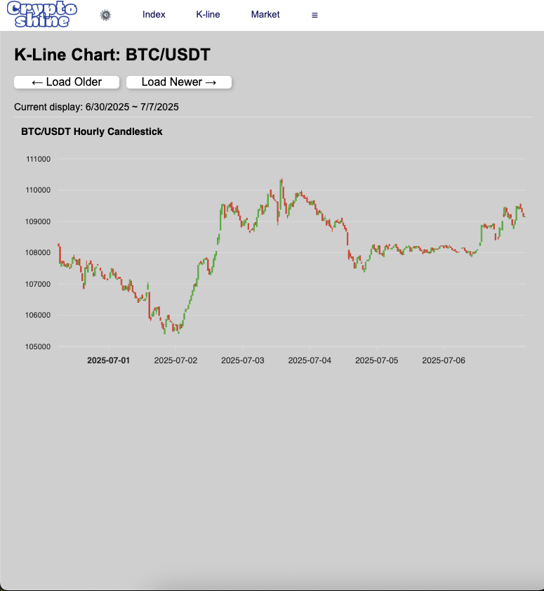

# 📉 Crypto Index Backend

**Description**: A Node.js + Express backend for fetching, storing, and serving hourly OHLC (K-line) cryptocurrency data for BTC and ETH.  
This backend powers the K-line chart feature in the [Crypto Index App](https://crypto-index-app.web.app/).

**Live API (Render)**: https://crypto-index-backend.onrender.com/kline 

**Topics**: nodejs, express, coingecko, crypto, postgres, backend, scheduled-tasks, ohlc, kline

## 🚀 Live Demo

👉 [Open App on Firebase][https://crypto-index-app.web.app/index.html](https://crypto-index-app.web.app/index.html)  


## 🔧 Tech Stack

- Node.js + Express
- PostgreSQL (hosted on Render or similar)
- CoinGecko API (for OHLC data)
- Axios (for HTTP requests)
- dotenv (for environment config)
- CORS-enabled (for frontend integration)

---

## 📌 Project Purpose

This backend was built to support my frontend project:  
**Crypto Index App** → [https://crypto-index-app.web.app](https://crypto-index-app.web.app)  
It provides hourly K-line (OHLC) data to feed the interactive chart component in the frontend, enabling real-time crypto insights for users.

---

## 🗂 Features

- Scheduled fetches every 15 minutes for:
  - Bitcoin (BTC/USDT)
  - Ethereum (ETH/USDT)
- Rate-limit aware with retry logic for CoinGecko API
- RESTful endpoints for:
  - Latest price candles
  - Historical OHLC data with optional date range
  - Multi-symbol and generic endpoints

---

## 🚀 Setup

### 1. Clone this repo
```bash
git clone https://github.com/YOUR_USERNAME/crypto-index-backend.git
cd crypto-index-backend

npm install
DATABASE_URL=your_postgres_connection_url
PORT=3001
npm start
# or with hot reload
npm run dev

